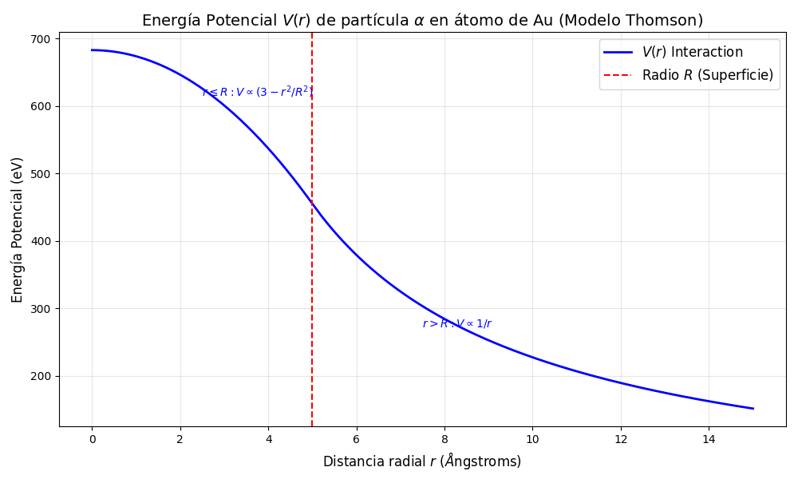
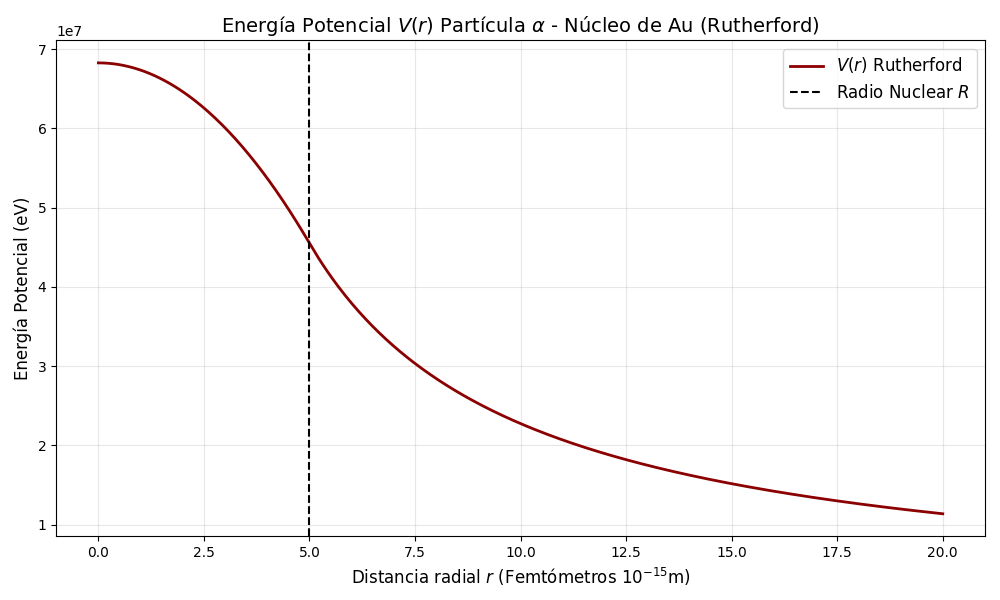
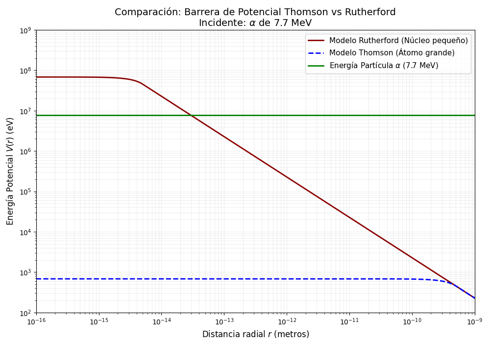

# Simulación de Potenciales Electrostáticos: Modelos Atómicos

Este repositorio contiene scripts en Python para simular y comparar el potencial eléctrico $V(r)$ experimentado por una partícula alfa ($\alpha$) al interactuar con un átomo de Oro ($Au$) bajo dos modelos históricos diferentes: el modelo de Thomson y el modelo de Rutherford.

## Descripción

El objetivo es visualizar numéricamente por qué las partículas alfa atraviesan los átomos en el modelo de Thomson pero rebotan en el modelo de Rutherford.

Se resuelven tres problemas:
1.  **Modelo de Thomson (Inciso C):** Calcula $V(r)$ asumiendo una esfera de carga positiva uniforme de radio $R \approx 10^{-10}$ m.
2.  **Modelo de Rutherford (Inciso D):** Calcula $V(r)$ asumiendo un núcleo puntual positivo de radio $R \approx 10^{-15}$ m.
3.  **Comparación (Inciso E):** Contrasta ambos potenciales frente a una energía cinética incidente de $7.7$ MeV.

## Implementación Computacional

Los scripts utilizados en este análisis pueden consultarse en:

- [Inciso C – Thomson](src/inciso_c.py)
- [Inciso D – Rutherford](src/inciso_d.py)
- [Inciso E – Comparación Logarítmica](src/inciso_e.py)


## Requisitos

El código está escrito en Python 3 y requiere las siguientes librerías para cálculo numérico y graficación:

* `numpy`
* `matplotlib`

Puedes instalarlas ejecutando:

```bash
pip install numpy matplotlib
```

# Inciso C: Modelo de Thomson

## Planteamiento Físico

Se consideró al átomo como una esfera de carga positiva uniforme de radio

$$
R = 5 \times 10^{-10} , \text{m}
$$

Para resolver este problema, se dividió el espacio en dos regiones:

### 1. Fuera del átomo ($r > R$)

Se comporta como una carga puntual (Ley de Coulomb).

$$
V(r) = \frac{kQq}{r}
$$

---

### 2. Dentro del átomo ($r \leq R$)

Se integra el campo eléctrico de una distribución uniforme, resultando en un potencial parabólico:

$$
V(r) = \frac{kQq}{2R} \left( 3 - \frac{r^2}{R^2} \right)
$$

---

## Gráfica Resultante

En la gráfica se observa un potencial suave y continuo.
El valor máximo es del orden de unos pocos **kilo-electronvoltios (keV)**.



---

# Inciso D: Modelo de Rutherford

## Planteamiento Físico

Se consideró que toda la carga positiva está concentrada en un núcleo muy pequeño de radio

$$
R = 5 \times 10^{-15} , \text{m}
$$

Las ecuaciones utilizadas son las mismas que en el inciso anterior, pero la diferencia radical en el radio
(( R ) es 100,000 veces menor) cambia drásticamente la magnitud del potencial.

---

## Gráfica Resultante

Aquí el potencial crece enormemente al acercarse al centro, alcanzando valores de **millones de electronvoltios (MeV)**.
La barrera de potencial es extremadamente alta y estrecha.



---

# Inciso E: Comparación y Conclusiones

## Análisis Comparativo

Se compararon las barreras de potencial máximas de ambos modelos contra una partícula ( \alpha ) incidente con energía cinética

$$
K = 7.7 , \text{MeV}
$$

1. **Barrera Thomson:** ≈ 0.00068 MeV
2. **Barrera Rutherford:**

   * ≈ 68 MeV (en el centro)
   * ≈ 45 MeV (en la superficie)
3. **Energía de la partícula:** 7.7 MeV

---

## Gráfica Comparativa y Conclusión

Se utilizó escala logarítmica en ambos ejes para poder visualizar las diferencias de magnitud (varios órdenes de magnitud) en una sola figura.
La línea verde representa la energía de la partícula.



---

## Conclusión

Como se observa en la gráfica comparativa:

* En el **Modelo de Thomson** (línea azul punteada), la energía de la partícula (línea verde) es muy superior a la barrera de potencial. Por lo tanto, la partícula atraviesa el átomo sin desviarse.

* En el **Modelo de Rutherford** (línea roja), la barrera de potencial es mucho mayor que la energía de la partícula. Esto implica que la partícula ( \alpha ) se detendrá antes de tocar el núcleo y será repelida violentamente, explicando así los rebotes observados en el experimento de Rutherford.

---
